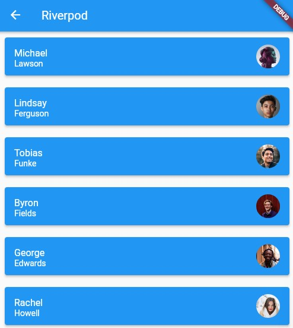

# Riverpod API Calls with Models
Parse JSON Arry, JSON Object on Flutter
## Getting Started

This project is a starting point for a Flutter application for json parsing with RiverPod.

A few resources to get you started if this is your first 
## Demo

## 🔗 Links

